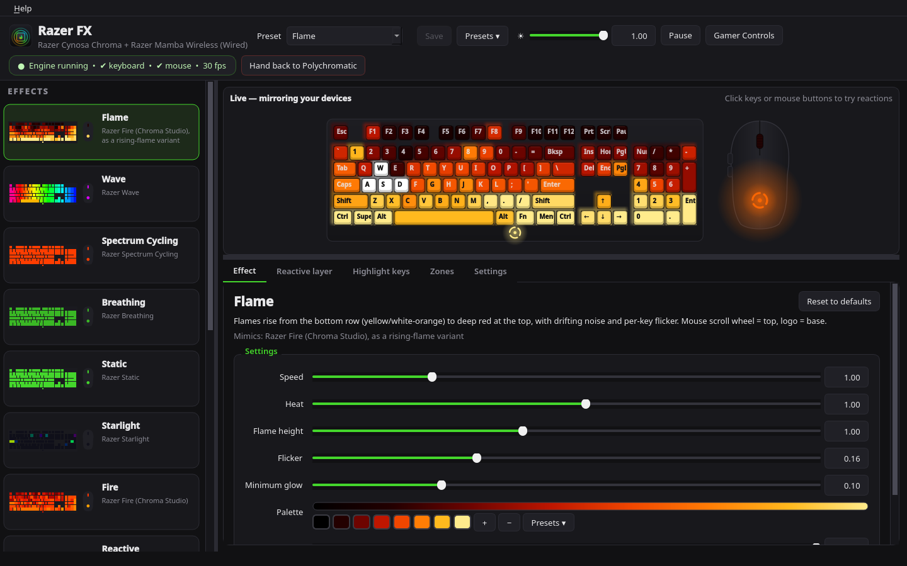
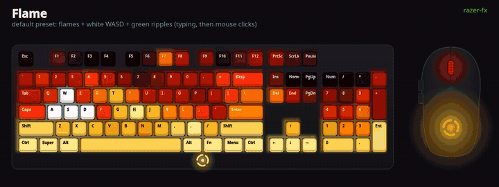
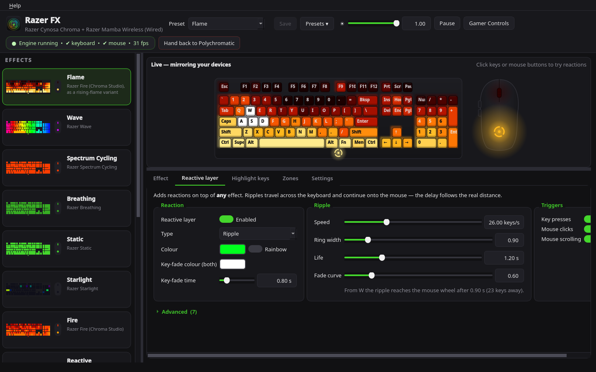
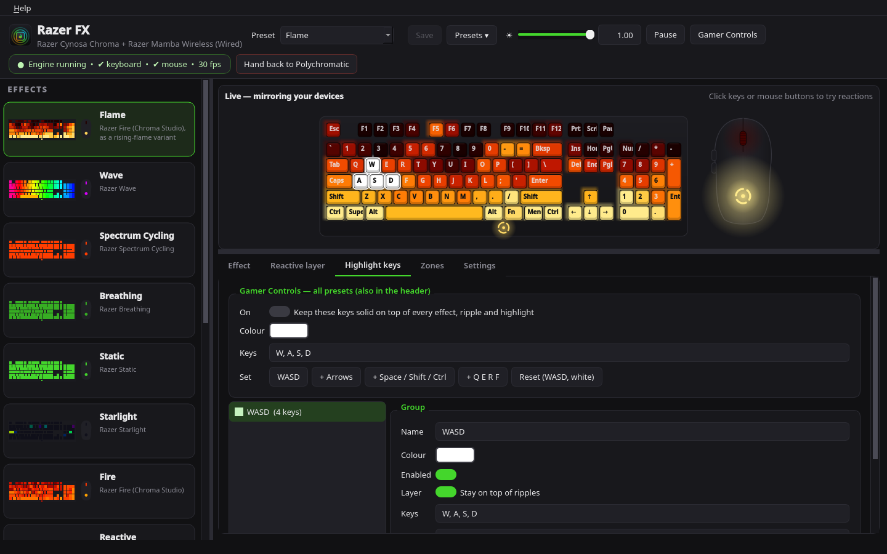
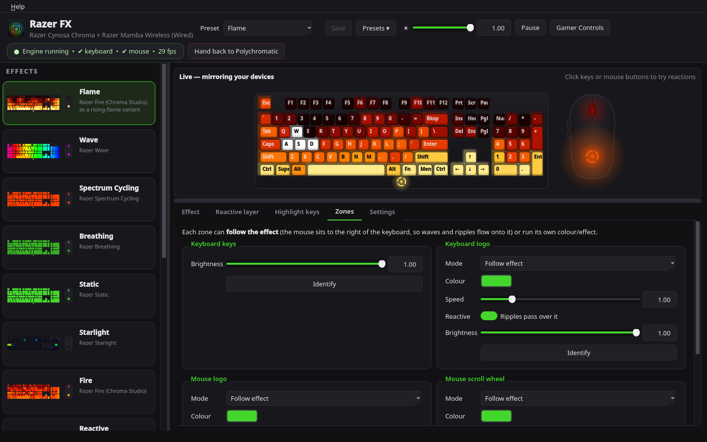
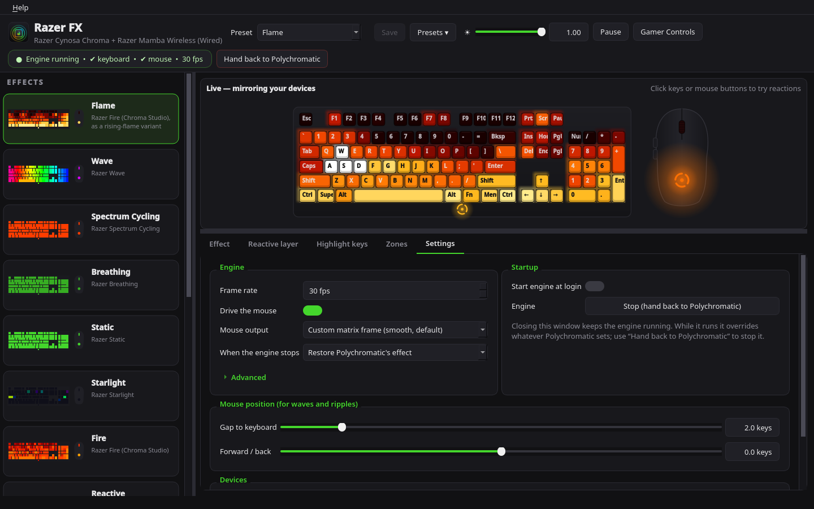
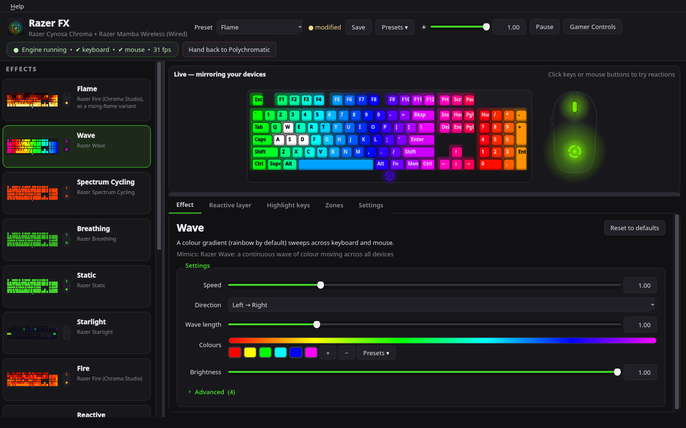
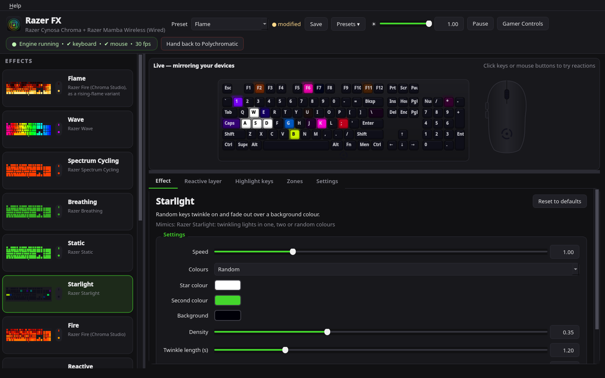
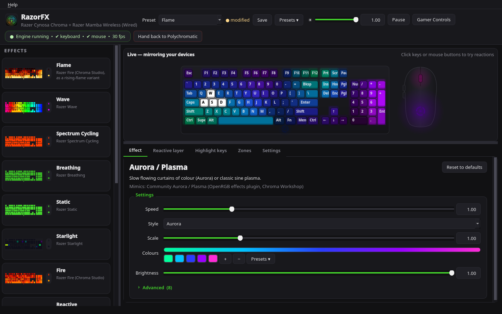

# RazorFX

**Chroma-style lighting effects for Razer keyboards and mice on Linux, built on [OpenRazer](https://openrazer.github.io/).**

RazorFX is a small background **engine** (a systemd user service) plus a **GUI** built with
Qt for Python (**PySide6**) that follows your desktop's light or dark theme and accent colour.
The engine renders animated effects at up to 30 fps onto your keyboard and mouse through the
OpenRazer driver, and reacts to key presses, mouse clicks and scrolling. The GUI lets you pick
and tune effects live, build presets, and manage per-zone lighting. Closing the GUI leaves the
engine (and your lighting) running.





> **Not affiliated with or endorsed by Razer Inc. Razer is a trademark of Razer Inc.**
> RazorFX is an independent community project. "Chroma", "Synapse" and the device names are also
> trademarks of Razer Inc. They are used here only to describe compatibility.
>
> *RazorFX was called "Razer FX" up to version 1.0.0. See
> [Upgrading from Razer FX 1.0](#upgrading-from-razer-fx-10).*

- [Features](#features)
- [Effects](#effects)
- [Compatibility](#compatibility)
- [Requirements](#requirements)
- [Download](#download)
- [Install from source / uninstall](#install-from-source--uninstall)
- [Upgrading from Razer FX 1.0](#upgrading-from-razer-fx-10)
- [Usage](#usage)
- [Gamer Controls](#gamer-controls)
- [Configuration](#configuration)
- [Troubleshooting](#troubleshooting)
- [How it works](#how-it-works)
- [Plugins](#plugins)
- [Development](#development)
- [Credits](#credits)
- [License](#license)

## Features

* **14 effects** modelled on Razer Chroma / Synapse effects plus a few community favourites
  (see the table below). Each has a main settings panel and an *Advanced* section that exposes every
  tunable, documented in [PARAMETERS.md](PARAMETERS.md).
* **One scene across devices**: the keyboard and mouse share a physical layout, so waves,
  wheels and ripples travel from the keyboard on to the mouse.
* **Reactive layer** on top of *any* effect: ripples and/or key fades triggered by keys, clicks
  and the scroll wheel.
* **Highlight key groups** at a fixed colour (WASD by default).
* **Gamer Controls**: one click keeps W A S D lit on top of everything, in every preset.
* **Zones**: keyboard keys, keyboard logo, mouse logo and mouse scroll wheel can each follow the
  effect or run their own static, breathing or spectrum colour, with separate brightness.
* **Presets**: 14 built-ins; save, duplicate, rename, revert, import and export
  (`*.razorfx.json`).
* **Live preview** of exactly what is sent to the devices. Click keys or mouse buttons in the preview to fire reactions.
* **Fast output**: one writer thread per device writing straight to the driver's sysfs files
  (D-Bus fallback), sending only changed rows. Reaches the driver's ceiling, about 28 updates/s, at about 3% CPU.
* **Robust**: the GUI survives engine restarts and crashes and reconnects by itself. The engine
  survives `openrazer-daemon` restarts and device re-plugs. When the engine stops, it hands the
  lighting back to OpenRazer / Polychromatic.
* **Follows your desktop's look**: light or dark and the accent colour come from the desktop
  (the XDG portal on GNOME, KDE and others, with fallbacks for KDE and GNOME) and change live when you switch.
  You can also pick Dark, Light or your own accent in Settings. The live preview always
  shows the devices' real colours.
* **Resizable UI** that fits 1366×768 screens: wrapping header, scrollable tabs, draggable splitters, and a saved
  window state.

| | |
|---|---|
|  |  |
|  |  |

## Effects

| Effect | Mimics | What it does |
|---|---|---|
| **Flame** | Razer *Fire* (Chroma Studio), as a rising-flame variant | Flames rise from the bottom row (yellow/white-orange) to deep red at the top, with drifting noise and per-key flicker |
| **Wave** | Razer *Wave* | A colour gradient (rainbow by default) sweeps across keyboard and mouse. 8 directions, plus centre-out and centre-in |
| **Spectrum Cycling** | Razer *Spectrum Cycling* | All LEDs cycle together through the hue wheel or your own colours |
| **Breathing** | Razer *Breathing* | Fades in and out (about 7 s period): a single colour, alternating dual colours, or a random colour each breath |
| **Static** | Razer *Static* | One solid colour. Combine it with highlights and the reactive layer |
| **Starlight** | Razer *Starlight* | Random keys twinkle and fade over a background, in one, two or random colours |
| **Fire** | Razer *Fire* (Chroma Studio) | Every key flickers independently through warm colours, hotter towards the bottom |
| **Reactive** | Razer *Reactive* | Pressed keys and clicked mouse LEDs light up, then fade (short, medium or long) |
| **Ripple** | Razer *Ripple* | Each key press or click sends a ring across the keyboard and on to the mouse |
| **Wheel** | Razer *Wheel* (Synapse 3 / Chroma Studio) | Colours spin around a centre point you choose, which can be on the mouse |
| **Matrix Rain** | Community "digital rain" (OpenRGB effects plugin / Chroma Workshop style) | Green code drips down each key column with bright heads and fading trails |
| **Aurora / Plasma** | Community Aurora / Plasma (OpenRGB effects plugin, Chroma Workshop) | Slow, flowing curtains of colour, or a classic sine plasma |
| **Heatmap** | Community typing heatmap | Every key press heats that key (and a little around it); the heat cools slowly |
| **Audio Meter** | Razer *Audio Meter* (Synapse 3) | Spectrum bars across the keyboard follow your PC's audio output, and the mouse shows the bass. Uses PipeWire's `pw-record` (or `parec`), with a demo animation if neither is available |

The effects are independent re-implementations based on how Razer's effects look and on Razer's
public descriptions. No Razer code or assets are used.

| | | |
|---|---|---|
|  |  |  |

## Compatibility

**Tested on real hardware:** Razer Cynosa Chroma (keyboard) and Razer Mamba Wireless (2018, mouse).

| Device | USB ID | Matrix | Notes |
|---|---|---|---|
| Razer Cynosa Chroma | 1532:022A | 6 × 22 | Hand-tuned per-key map. The logo LED is matrix cell (0,20), confirmed on real hardware |
| Razer Mamba Wireless (2018), wired | 1532:0073 | 1 × 16 | Hand-tuned: column 0 is the scroll wheel, column 1 the logo. Columns 2–15 have no LEDs |
| Razer Mamba Wireless (2018), receiver | 1532:0072 | 1 × 16 | As above. Lower the mouse FPS to save battery and radio traffic |

**Everything else is best-effort, using OpenRazer's layout data.** Any device that
`openrazer-daemon` drives with a custom-frame matrix (`matrix_custom_frame`) is detected
automatically, and nothing is tied to a serial number. At start-up the engine builds an LED map for
each one from its matrix size (`device.fx.advanced.rows/cols`), its type and OpenRazer's key tables,
then logs which map it chose (`layout: keyboard …` in `journalctl --user -u razorfx-engine`;
also `"layout"` in the engine status). Maps are chosen in this order:

1. **Your layout packs** (see below), if one matches the device.
2. **Hand-tuned maps** (the tested devices above).
3. **OpenRazer's key tables.** Keyboards with OpenRazer's standard 6 × 22 matrix (most
   BlackWidow, Huntsman, Ornata and Cynosa models) use the daemon's own `KEY_MAPPING` /
   `EVENT_MAPPING`, the same tables OpenRazer's built-in ripple uses. Tartarus and Orbweaver keypads use
   their own tables. The tables are read at run time from the installed `openrazer_daemon`
   (GPL-2.0-or-later, © the OpenRazer contributors); RazorFX doesn't copy them.
4. **A generic grid** sized to the matrix (TKL, 60 %, laptops such as the Blade, unknown models).
   Every key goes to the cell nearest its physical position, so effects, ripples, highlights and
   Gamer Controls still render, roughly in the right place.

Devices that aren't keyboards are treated as strips. A mouse without a hand-tuned map has its LEDs
placed around its outline; all of them belong to the *Mouse logo* zone. Mouse mats, headsets, docks
and other accessories each get a strip under the keyboard, so a wave sweeps across them too. They share one
zone, *Other devices*, on the Zones tab. Caveats:

* The on-screen preview always draws the Cynosa Chroma and the Mamba. Your real devices follow
  their own maps.
* Matrix cells with no LED simply stay dark. On ISO boards and in the generic grid, a few keys
  may land one cell off.
* Reactive input (key and click events) is read from `/dev/input/by-id/usb-Razer_*`. You can
  override the nodes with `RAZORFX_KB_GLOBS` / `RAZORFX_MOUSE_GLOBS` (colon-separated globs).
* Devices without a custom-frame matrix are ignored. Bluetooth connections are untested.

**Layout packs: add your own device, no code needed.** If your device uses the generic grid or a
key lights the wrong LED, write a small JSON *layout pack* (device name/USB id, matrix size,
key → `[row, col]`, and mouse zones), starting from
[`examples/layouts/example-layout.json`](examples/layouts/example-layout.json). Drop it into
`~/.local/share/razorfx/layouts/`, then run `systemctl --user restart razorfx-engine`. Packs are
data only: RazorFX validates them and never executes anything in them. Plugins can register packs
too (`ctx.register_layout`). The full order RazorFX uses is: **your layout packs**, then the
built-in hand-tuned maps, then OpenRazer's tables, then the generic grid. The format is documented in
[docs/LAYOUTS.md](docs/LAYOUTS.md). Please share working packs with a pull request
([CONTRIBUTING.md](CONTRIBUTING.md#new-devices)).

## Requirements

* Linux with a systemd user session (developed and tested on Ubuntu with GNOME).
* **OpenRazer** 3.x (driver + daemon), with your user in the `plugdev` group. Install it with
  your distro's package or the [OpenRazer PPA](https://openrazer.github.io/#download):
  ```
  sudo add-apt-repository ppa:openrazer/stable && sudo apt install openrazer-meta
  sudo gpasswd -a $USER plugdev     # then log out and back in
  ```
* Python 3.9+ with **PySide6** (Qt for Python, 6.5 or newer), numpy, dbus-python and evdev.
  `install.sh` installs any that are missing:

  | Distro | Packages |
  |---|---|
  | Ubuntu 25.10+ (incl. 26.04 LTS), Debian 13+ | `python3-pyside6.qtcore python3-pyside6.qtgui python3-pyside6.qtwidgets python3-evdev python3-numpy python3-dbus` |
  | Ubuntu 24.04 / 22.04, Debian 12 | `python3-evdev python3-numpy python3-dbus python3-venv`. No PySide6 package exists, so `install.sh` puts `PySide6-Essentials` from PyPI into a private venv (`~/.local/share/razorfx/venv`) |
  | Fedora | `python3-pyside6 python3-evdev python3-numpy python3-dbus` |
  | Arch | `pyside6 python-evdev python-numpy python-dbus` |
  | openSUSE | `python3-pyside6` (Tumbleweed: `python313-pyside6`) `python3-evdev python3-numpy python3-dbus-python` |

  For example, on Ubuntu 26.04:
  ```
  sudo apt install python3-pyside6.qtwidgets python3-evdev python3-numpy python3-dbus
  ```
  `./install.sh --pip-pyside` always takes PySide6 from PyPI (into the venv), whatever the
  distro ships. Only the GUI needs PySide6; the engine uses just numpy, dbus and evdev.
  `python3-openrazer` (the `openrazer.client` library) comes with OpenRazer.
* Optional: PipeWire's `pw-record` (installed by default on Ubuntu), or `parec`, for the Audio Meter.
* [Polychromatic](https://polychromatic.app/) is **not** required, but works alongside RazorFX.

## Download

Ready-made packages of the free version are attached to every
[GitHub Release](https://github.com/nitrofireinc-pixel/razorFX/releases/latest).
All of them need the OpenRazer driver and daemon from your distribution
([openrazer.github.io](https://openrazer.github.io/#download)); RazorFX never installs a kernel driver itself.

| Distribution | File | Install |
|---|---|---|
| Debian 13+, Ubuntu 25.10+ and derivatives | `razorfx_<version>_all.deb` | `sudo apt install ./razorfx_<version>_all.deb` |
| Fedora (with the [OpenRazer repository](https://openrazer.github.io/#fedora)) | `razorfx-<version>-1.noarch.rpm` | `sudo dnf install ./razorfx-<version>-1.noarch.rpm` |
| Arch Linux, Manjaro, EndeavourOS | `razorfx-<version>-aur.tar.gz` (PKGBUILD) | unpack, then `makepkg -si` (or use the AUR package once published) |
| Any x86_64 distribution, including Ubuntu 24.04 and Debian 12 | `RazorFX-<version>-x86_64.AppImage` | `chmod +x RazorFX-*.AppImage`, run it; `--integrate` adds it to the app menu |
| Anything else / from source | `git clone` | `./install.sh` (below) |

Notes:
* **Native packages** install RazorFX for all users under `/usr`. On first start, the window
  enables and starts the engine (`razorfx-engine.service`, a systemd *user* service) for you, as
  `install.sh` does. *Settings ▸ Start engine at login* changes that per user.
* **The AppImage** bundles Python, Qt (PySide6) and the OpenRazer client library. It runs the
  engine as a user service that points at the AppImage file, and keeps that service up to date
  when you move or replace the file. `RazorFX-*.AppImage --unintegrate` removes the menu entry
  and the service. It needs glibc 2.35 or newer, and on X11 `libxcb-cursor0`.
* Use only **one** kind of install at a time. Run `./uninstall.sh` before switching from
  `install.sh` to a package. Your settings in `~/.config/razorfx` work with all of them.
* Each release has a `SHA256SUMS` file: `sha256sum -c SHA256SUMS --ignore-missing`.
* Packaging sources: `debian/`, `packaging/` (see `packaging/README.md`); releases are built by
  `.github/workflows/release.yml` when a `v*` tag is pushed.

## Install from source / uninstall

```
git clone https://github.com/nitrofireinc-pixel/razorFX.git
cd razorFX
./install.sh               # per-user install; sudo is used only for missing system packages
./install.sh --no-deps     # skip the system-package step
./install.sh --pip-pyside  # take PySide6 from PyPI instead of the distro
```

`install.sh` runs as your normal user. It does the following:
* copies the app to `~/.local/share/razorfx`
* creates the launchers `~/.local/bin/razorfx` and `~/.local/bin/razorfx-engine`
* adds a desktop entry ("RazorFX" in your app menu) and icons
* installs, enables and starts the user service `razorfx-engine.service`
* migrates a Razer FX 1.0 install, if there is one (see below)

On first start the engine uses the **Flame** preset. Run `./install.sh` again to upgrade in
place. Your config, your plugins and your *Start engine at login* choice are kept.

```
./uninstall.sh           # remove the app and the service; keep ~/.config/razorfx (presets) and plugins
./uninstall.sh --purge   # ... and delete ~/.config/razorfx, plugins and plugin data too
```

When the engine stops, the lighting goes back to whatever OpenRazer / Polychromatic had set.
You can change that in Settings to turn the lights off or leave the last frame.

## Upgrading from Razer FX 1.0

Version 1.1 renamed the project from *Razer FX* to *RazorFX*, together with its files and
commands:

| | Razer FX 1.0 | RazorFX 1.1 |
|---|---|---|
| Settings + presets | `~/.config/razer-fx/` | `~/.config/razorfx/` |
| Program files | `~/.local/share/razer-fx/` | `~/.local/share/razorfx/` (plus `plugins/`) |
| Service | `razer-fx-engine.service` | `razorfx-engine.service` |
| Commands | `razer-fx`, `razer-fx-engine` | `razorfx`, `razorfx-engine` |
| Desktop entry / icon | `razer-fx` | `razorfx` |
| GUI log, socket | `~/.cache/razer-fx/`, `$XDG_RUNTIME_DIR/razer-fx/` | `~/.cache/razorfx/`, `$XDG_RUNTIME_DIR/razorfx/` |
| Preset files | `*.razerfx.json` | `*.razorfx.json` (old files still import) |

Just run the new `./install.sh` (close the old window first). It:
1. stops, disables and removes `razer-fx-engine.service`, and enables `razorfx-engine.service`
   only if the old one was enabled;
2. **copies** `~/.config/razer-fx/` (all presets, settings and the window layout) to
   `~/.config/razorfx/` and writes a `MIGRATED.txt` note there. The old directory is **not
   changed or deleted**, so the 1.0 tarball still works if you go back. Delete it yourself once
   you're happy. The copy only happens while `~/.config/razorfx/config.json` doesn't exist, so it
   never overwrites anything;
3. removes the old launchers, desktop entry and icons, and the old program files from
   `~/.local/share/razer-fx/`. Anything else in there (for example backup folders) is left alone;
4. keeps `razer-fx` and `razer-fx-engine` as aliases for the new commands (deprecated, to be
   removed in a later release).

If you run RazorFX from a checkout without installing, the engine and the GUI do the same
settings copy on their first start. If you installed `70-razer-fx-uaccess.rules` in
`/etc/udev/rules.d/`, it keeps working. Only its file name differs from the new
`70-razorfx-uaccess.rules`.

## Usage

Open **RazorFX** from the app menu, or run `razorfx`.

* **Effects gallery** (left): animated thumbnails; click one to switch.
* **Live preview**: mirrors what the engine sends to the devices. Click keys or mouse buttons in
  it to try reactions.
* **Effect** tab: the main settings for the current effect (speed, brightness, colours and
  gradients, direction, density…). The collapsible **Advanced** section exposes every remaining
  constant. Each tooltip shows the default.
* **Reactive layer**: ripples and/or key fades on top of any effect. Set the colour (or rainbow), speed, ring
  width, life and fade curve, and the triggers (keys, clicks, scrolling).
* **Highlight keys**: groups of keys held at a fixed colour. Keys show as keycap chips. Remove one
  with Backspace, Delete or its ×, change a group's name, colour, layer or enabled state, remove
  groups, or **Restore defaults** (one WASD group in white). Adding keys and groups (+ Add key,
  Add group, picking keys on the preview) will be part of RazorFX Pro (coming soon).
  Each group can sit above or below the ripples. This tab also has the Gamer Controls box.
* **Zones**: keyboard keys, keyboard logo, mouse logo and mouse scroll wheel. Each one follows the
  effect or gets its own static, breathing or spectrum colour, or is turned off. **Identify** blinks the zone on the device.
* **Settings**: FPS, whether to drive the mouse, mouse output method, what happens when the engine stops,
  start at login, mouse position (how far effects travel to reach it), engine I/O options,
  device and input-node status, and **Appearance**: theme (System, Dark, Light) and accent colour
  (System, RazorFX green, or your own colour).
* **Header**: preset picker, **Save**, the **Presets ▾** menu (save as, duplicate, rename, revert,
  delete, export this preset or all of them, import, restore built-ins), master brightness, **Pause**,
  **Gamer Controls** and **Hand back to Polychromatic** (stops the engine).
* **Help ▸ About** (or F1) shows the version and edition, the
  creator (Nitrofire Computing) and project link, the license with the plugin exception, the
  credits (OpenRazer first) and the Razer trademark notice. **Copy system info** copies the
  app, Python, PySide6/Qt, OpenRazer, driver and kernel versions plus the detected devices
  (never serial numbers) for bug reports ([screenshot](docs/screenshots/12-about.png)).

Command line:
```
razorfx-engine --status                  # what the running engine is doing
systemctl --user restart razorfx-engine  # restart the engine
systemctl --user reload  razorfx-engine  # reload ~/.config/razorfx/config.json
journalctl --user -u razorfx-engine      # engine log
```

Preset files (`*.razorfx.json`) hold one preset or all of them:
`{"format": "razorfx-presets", "version": 1, "presets": {name: profile}}`. Importing never
overwrites existing presets: clashing names get " (2)", and out-of-range values are clamped. Use
*File ▸ Import presets…* and *File ▸ Export all presets…*. A commented template is in
[`examples/presets/example-preset.json`](examples/presets/example-preset.json), with every field
documented in [`examples/presets/README.md`](examples/presets/README.md). Packages install both
under `/usr/share/doc/razorfx/examples/`.

## Gamer Controls

The **Gamer Controls** button in the header (also on the *Highlight keys* tab) keeps
**W A S D solid white on top of everything**: the effect, ripples, key fades, highlight groups and
zone dimming, in every preset. Only master brightness still applies.

On the Highlight keys tab the keys appear as keycap chips: **[W] [A] [S] [D]**. To remove a key,
click its chip (or Tab to it) and press Backspace or Delete, or hover over it and click its **×**.
**Restore defaults** brings back W A S D in white, and you can change the colour there too
([screenshot](docs/screenshots/13-gamer-chips.png)). Adding your own keys (**+ Add key**, then press
any key) will be a RazorFX Pro feature. Pro isn't for sale yet, so the free version shows a locked
"Add key · Pro: coming soon" chip, which you can hide with *Settings ▸ Plugins ▸ Show RazorFX Pro
previews*. The setting is global (`gamer_controls`, `gamer_keys`,
`gamer_color` in `config.json`) and separate from each preset's own highlight groups. It is off by default.

## Configuration

Everything is stored in `~/.config/razorfx/config.json`, which the GUI writes for you. The window
size and splitter positions are kept in `~/.config/razorfx/gui.ini`. Global settings:

| Key | Default | Meaning |
|---|---|---|
| `fps` | 30 | Render rate |
| `include_mouse` | true | Drive the mouse as part of the scene |
| `mouse_method` | `"matrix"` | `matrix` (custom frames), or `zones` (per-zone static colours, a fallback) |
| `mouse_max_fps` | 30 | Cap on mouse updates (wireless mice: lower it to save battery) |
| `mouse_gap`, `mouse_dy` | 2.0, 0.0 | Mouse position: gap to the numpad (key widths) and forward/back offset (key heights) |
| `master_brightness` | 1.0 | Brightness for all devices |
| `exit_mode` | `"restore"` | When the engine stops: `restore` OpenRazer's effect, `off`, or `leave` the last frame |
| `gamer_controls`, `gamer_keys`, `gamer_color` | off, WASD, white | See [Gamer Controls](#gamer-controls) |
| `device_io` | `"auto"` | `auto` (direct sysfs when writable, else D-Bus) or `dbus` |
| `row_delta` | 1 | Skip a keyboard row if no channel changed by more than this (0–32; full refresh every 2 s) |
| `custom_every_frame` | false | Re-send custom mode after every frame (for devices that otherwise update only occasionally) |
| `custom_refresh_s` | 5.0 | How often (s) to re-assert custom mode |

Per-effect parameters are listed in [PARAMETERS.md](PARAMETERS.md).

## Troubleshooting

**The lights don't change, or Settings says "no devices".**
Check that OpenRazer sees the device: `python3 -c "from openrazer.client import DeviceManager as D; print([d.name for d in D().devices])"`.
If the list is empty, make sure `openrazer-daemon` is running
(`systemctl --user status openrazer-daemon`) and that the `razerkbd` / `razermouse` kernel modules are
loaded (`lsmod | grep razer`). After a kernel update, DKMS may need to rebuild them.

**"Permission denied" or no reactions to key presses or clicks.**
1. Your user must be in **`plugdev`**: run `groups`; if it's missing, run `sudo gpasswd -a $USER plugdev`, then log out and back in.
   On most OpenRazer installs this also gives you direct (fast) access to the driver's sysfs files.
2. Reactive effects read `/dev/input/by-id/usb-Razer_*-event-*`. If Settings (or `install.sh`)
   says these nodes are *not readable*, install the optional **uaccess** udev rule. It gives the user
   logged in at the seat read access to those nodes only:
   ```
   sudo install -m644 extras/70-razorfx-uaccess.rules /etc/udev/rules.d/
   sudo udevadm control --reload-rules      # then re-plug the devices
   ```
   The rule lists the tested USB IDs. For other devices, add their product ID (from `lsusb`) or
   use the generic line commented in the file.

**Low frame rate or laggy mouse.** The OpenRazer driver waits after each USB report: about 6 ms per
keyboard row, and about 31 ms per report on the Mamba Wireless. RazorFX already uses parallel writer
threads and sysfs; check that Settings shows *sysfs* rather than *D-Bus* for each device. `python3
tools/diag_timing.py` measures your devices. It pauses the engine while it runs.

**A device only updates every few seconds.** Enable *Settings ▸ Engine ▸ Advanced ▸ Re-send “custom effect”
after every frame* (`custom_every_frame`).

**Polychromatic and RazorFX fight over the lights.** While the engine runs, it owns the lighting.
Use **Hand back to Polychromatic**, or untick *Settings ▸ Start engine at login*.

**The GUI closes unexpectedly.** Look in `~/.cache/razorfx/gui.log`. The GUI ignores SIGHUP and logs
exceptions instead of aborting, so the log should say why. Please include it in bug reports.

**The engine isn't running.** `journalctl --user -u razorfx-engine -n 50`.

## How it works

```
 razorfx (PySide6 GUI) ──JSON over $XDG_RUNTIME_DIR/razorfx/engine.sock──▶ razorfx-engine
                                                                           │  evdev: key / click / wheel events
                                                                           ▼
                                  OpenRazer driver sysfs (plugdev) / openrazer-daemon (D-Bus)
                                                    ├─▶ keyboard matrix (e.g. 6×22)
                                                    └─▶ mouse matrix (e.g. 1×16)
```

The engine composites the effect, reactive layer, highlight groups, Gamer Controls, zones and
master brightness into one frame per tick. Each device has a writer thread that always takes the newest
frame and writes only the rows that changed. Mouse motion is filtered in the kernel (`EVIOCSMASK`), so
moving the mouse costs no CPU. Measured on a Cynosa Chroma + Mamba Wireless: keyboard about 28 and
mouse about 27 updates/s, which is the driver's limit, with the engine at about 3% of one core.

## Plugins

RazorFX 1.1 adds a small, documented **plugin API** (version 1.0, provisional). A plugin is a
folder in `~/.local/share/razorfx/plugins/` with a `plugin.json` and a Python module whose
`register(ctx)` function gets a context object. Through it the plugin can add *Plugins* menu entries,
keep settings, read the engine status and react to events. Plugins are loaded only by the GUI, never by the
engine, and a failing plugin is shown in *Settings ▸ Plugins* instead of crashing anything.
`razorfx --no-plugins` starts without them. See [docs/PLUGIN_API.md](docs/PLUGIN_API.md) and the
example in [examples/plugins/hello/](examples/plugins/hello/).

Plugins run with your user's rights, so only install plugins you trust.

Thanks to the [plugin exception](LICENSE-EXCEPTION), plugins that use only this API may be
released under any license (see [License](#license)).

## Development

```
python3 -m unittest discover -s tests -p 'test_*.py'      # unit + GUI tests (offscreen Qt, PySide6)
OR=/path/to/openrazer dbus-run-session -- python3 tests/integration_test.py
                                                          # real openrazer-daemon + fake devices
python3 tests/gui_engine_restart_test.py                  # GUI survives engine restarts/crashes
OR=/path/to/openrazer bash tests/install_test.sh          # install/uninstall/1.0-migration dry run (stub systemctl)
python3 tools/gui_fit_screenshots.py                      # window fit at 1920x1080, 1366x768, 125%
OR=/path/to/openrazer dbus-run-session -- xvfb-run -a -s "-screen 0 1600x1000x24" python3 tests/gui_screenshots.py
python3 tools/gen_params_doc.py                           # regenerate PARAMETERS.md
python3 tools/render_preview.py out.mp4                   # render a demo video (needs ffmpeg)
```

The integration tests need an OpenRazer source checkout (tested with v3.12.4). Its fake-driver
scripts and daemon are used directly and are not part of this repository. See
[CONTRIBUTING.md](CONTRIBUTING.md).

## Credits

* **[OpenRazer](https://github.com/openrazer/openrazer)** (GPL-2.0-or-later): driver and daemon that
  RazorFX drives. The keyboard key-to-matrix mapping follows the daemon's `KEY_MAPPING` /
  `EVENT_MAPPING` tables, and the test suite runs OpenRazer's fake-device test harness.
* **[OpenRGB](https://gitlab.com/CalcProgrammer1/OpenRGB)** (GPL-2.0-only): its
  `RazerDevices.cpp` was used as a *reference* for the Cynosa Chroma logo cell and the
  Mamba Wireless LED zones (scroll wheel = column 0, logo = column 1). No OpenRGB code is included.
* **[Polychromatic](https://github.com/polychromatic/polychromatic)** (GPL-3.0): its
  keyboard device maps were used as a *reference* to cross-check the keyboard layout. No
  Polychromatic code is included.
* Effect designs are inspired by Razer Chroma / Synapse effects and the OpenRGB effects plugin.

* **[Qt for Python / PySide6](https://doc.qt.io/qtforpython-6/)** (LGPL-3.0): the GUI toolkit.

## License

© 2026 Nitrofire Computing. RazorFX is made by **Nitrofire Computing**.

RazorFX is free software: you can redistribute it and/or modify it under the terms of the
**GNU General Public License** as published by the Free Software Foundation, either **version 3** of
the License, or (at your option) any later version, **with the RazorFX plugin exception**:

```
SPDX-License-Identifier: GPL-3.0-or-later WITH AdditionRef-RazorFX-plugin-exception
```

The [plugin exception](LICENSE-EXCEPTION) is an additional permission under GPLv3 section 7. It lets
separately distributed, independently written plugins that interact with RazorFX *only* through the
documented [plugin API](docs/PLUGIN_API.md) use any license, including a proprietary one.
RazorFX itself, and any modified version of it, stays under the GPL. The exception doesn't cover
code that reaches into RazorFX's internals, and it doesn't change the licenses of the libraries RazorFX
uses (PySide6: LGPL-3.0, OpenRazer: GPL-2.0-or-later). `AdditionRef-` is the SPDX 3.0 way to name a
custom exception. The example plugin and the API doc's snippets are 0BSD, so you can copy them freely.

This program is distributed in the hope that it will be useful, but WITHOUT ANY WARRANTY; without
even the implied warranty of MERCHANTABILITY or FITNESS FOR A PARTICULAR PURPOSE. See the
[LICENSE](LICENSE) file for the full text.
